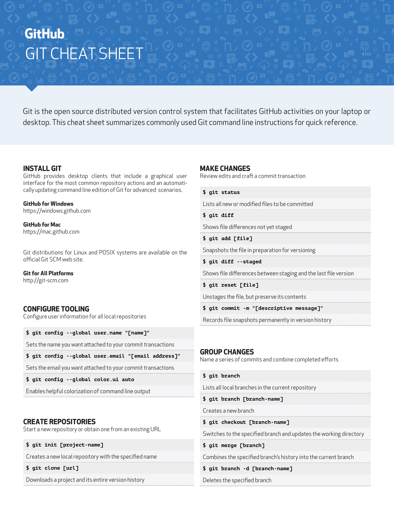
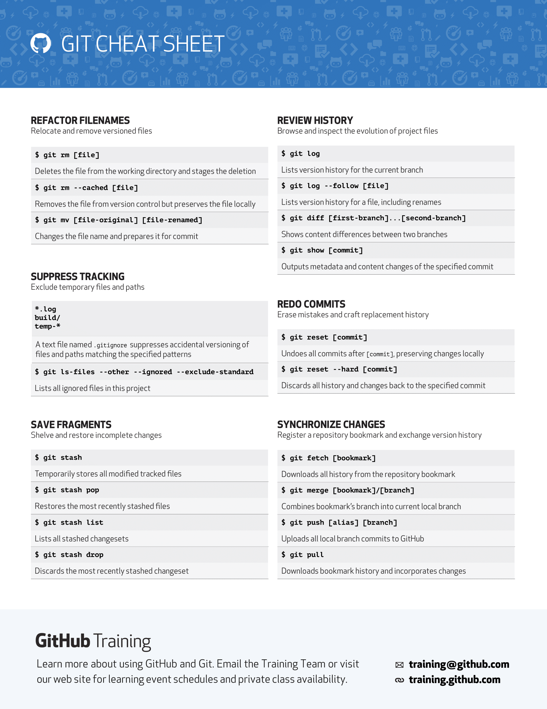

[国外网友制作的Git Cheat Sheet](https://gitee.com/liaoxuefeng/learn-java/raw/master/teach/git-cheatsheet.pdf)
************
要随时掌握工作区的状态，使用git status命令。

如果git status告诉你有文件被修改过，用git diff可以查看修改内容。


**************


HEAD指向的版本就是当前版本，因此，Git允许我们在版本的历史之间穿梭，使用命令git reset --hard commit_id。

穿梭前，用git log可以查看提交历史，以便确定要回退到哪个版本。

要重返未来，用git reflog查看命令历史，以便确定要回到未来的哪个版本。


场景1：当你改乱了工作区某个文件的内容，想直接丢弃工作区的修改时，用命令git checkout -- file。

场景2：当你不但改乱了工作区某个文件的内容，还添加到了暂存区时，想丢弃修改，分两步，第一步用命令git reset HEAD <file>，就回到了场景1，第二步按场景1操作。

场景3：已经提交了不合适的修改到版本库时，想要撤销本次提交，参考版本回退一节，不过前提是没有推送到远程库。


命令git rm用于删除一个文件。如果一个文件已经被提交到版本库，那么你永远不用担心误删，但是要小心，你只能恢复文件到最新版本，你会丢失最近一次提交后你修改的内容。

********************

Git鼓励大量使用分支：

查看分支：git branch

创建分支：git branch <name>

切换分支：git checkout <name>

创建+切换分支：git checkout -b <name>

合并某分支到当前分支：git merge <name>

删除分支：git branch -d <name>

  **********************
  
  当Git无法自动合并分支时，就必须首先解决冲突。解决冲突后，再提交，合并完成。

解决冲突就是把Git合并失败的文件手动编辑为我们希望的内容，再提交。

用git log --graph命令可以看到分支合并图。

************


Git分支十分强大，在团队开发中应该充分应用。

合并分支时，加上--no-ff参数就可以用普通模式合并，合并后的历史有分支，能看出来曾经做过合并，而fast forward合并就看不出来曾经做过合并。

*********

修复bug时，我们会通过创建新的bug分支进行修复，然后合并，最后删除；

当手头工作没有完成时，先把工作现场git stash一下，然后去修复bug，修复后，再git stash pop，回到工作现场；

在master分支上修复的bug，想要合并到当前dev分支，可以用git cherry-pick <commit>命令，把bug提交的修改“复制”到当前分支，避免重复劳动。


**************
开发一个新feature，最好新建一个分支；

如果要丢弃一个没有被合并过的分支，可以通过git branch -D <name>强行删除。


**********
本地仓库关联到远程  git remote add origin https://github.com/CedarChennn/PythonApplication.git

查看远程库信息，使用git remote -v；

本地新建的分支如果不推送到远程，对其他人就是不可见的；

从本地推送分支，使用git push origin branch-name，如果推送失败，先用git pull抓取远程的新提交；

在本地创建和远程分支对应的分支，使用git checkout -b branch-name origin/branch-name，本地和远程分支的名称最好一致；

建立本地分支和远程分支的关联，使用git branch --set-upstream branch-name origin/branch-name；

从远程抓取分支，使用git pull，如果有冲突，要先处理冲突。

********

rebase操作可以把本地未push的分叉提交历史整理成直线；

rebase的目的是使得我们在查看历史提交的变化时更容易，因为分叉的提交需要三方对比。


*****
命令git tag <tagname>用于新建一个标签，默认为HEAD，也可以指定一个commit id；

命令git tag -a <tagname> -m "blablabla..."可以指定标签信息；

命令git tag可以查看所有标签。

******
命令git push origin <tagname>可以推送一个本地标签；

命令git push origin --tags可以推送全部未推送过的本地标签；

命令git tag -d <tagname>可以删除一个本地标签；

命令git push origin :refs/tags/<tagname>可以删除一个远程标签。

*******

忽略某些文件时，需要编写.gitignore；

.gitignore文件本身要放到版本库里，并且可以对.gitignore做版本管理！

*****
git config --global alias.lg "log --color --graph --pretty=format:'%Cred%h%Creset -%C(yellow)%d%Creset %s %Cgreen(%cr) %C(bold blue)<%an>%Creset' --abbrev-commit"


# Git 笔记

## Git 介绍

- Git 是分布式版本控制系统
- 集中式 VS 分布式，SVN VS Git

    1. SVN 和 Git 主要的区别在于历史版本维护的位置;
    2. Git 本地仓库包含代码库还有历史库，在本地的环境开发就可以记录历史而 SVN 的历史库存在于中央仓库，每次对比与提交代码都必须连接到中央仓库才能进行;
    3. 这样的好处在于：

        - 自己可以在脱机环境查看开发的版本历史。
        - 多人开发时如果充当中央仓库的 Git 仓库挂了，可以随时创建一个新的中央仓库然后同步就立刻恢复了中央库。

## Git 命令

### Git 配置

```base
$ git config --global user.name "Your Name"
$ git config --global user.email "email@example.com"
```

`git config`命令的`--global`参数，表明这台机器上的所有 Git 仓库都会使用这个配置，也可以对某个仓库指定不同的用户名和邮箱地址。

### 创建版本库

#### 初始化一个 Git 仓库

```bash
$ git init
```

#### 添加文件到 Git 仓库

包括两步：

```bash
$ git add <file>
$ git commit -m "description"
```

`git add`可以反复多次使用，添加多个文件，`git commit`可以一次提交很多文件，`-m`后面输入的是本次提交的说明，可以输入任意内容。

### 查看工作区状态

```bash
$ git status
```

### 查看修改内容

```bash
$ git diff
```

```bash
$ git diff --cached
```

```bash
$ git diff HEAD -- <file>
```

- `git diff` 可以查看工作区(work dict)和暂存区(stage)的区别
- `git diff --cached` 可以查看暂存区(stage)和分支(master)的区别
- `git diff HEAD -- <file>` 可以查看工作区和版本库里面最新版本的区别

### 查看提交日志

```bash
$ git log
```

简化日志输出信息

```bash
$ git log --pretty=oneline
```

### 查看命令历史

```bash
$ git reflog
```

### 版本回退

```bash
$ git reset --hard HEAD^
```

以上命令是返回上一个版本，在 Git 中，用`HEAD`表示当前版本，上一个版本就是`HEAD^`，上上一个版本是`HEAD^^`，往上 100 个版本写成`HEAD~100`。

### 回退指定版本号

```bash
$ git reset --hard commit_id
```

commit_id 是版本号，是一个用 SHA1 计算出的序列

### 工作区、暂存区和版本库

工作区：在电脑里能看到的目录；
版本库：在工作区有一个隐藏目录`.git`，是 Git 的版本库。
Git 的版本库中存了很多东西，其中最重要的就是称为 stage（或者称为 index）的暂存区，还有 Git 自动创建的`master`，以及指向`master`的指针`HEAD`。
[理解]
进一步解释一些命令：

- `git add`实际上是把文件添加到暂存区
- `git commit`实际上是把暂存区的所有内容提交到当前分支

### 撤销修改

#### 丢弃工作区的修改

```bash
$ git checkout -- <file>
```

该命令是指将文件在工作区的修改全部撤销，这里有两种情况：

1. 一种是 file 自修改后还没有被放到暂存区，现在，撤销修改就回到和版本库一模一样的状态；
2. 一种是 file 已经添加到暂存区后，又作了修改，现在，撤销修改就回到添加到暂存区后的状态。

总之，就是让这个文件回到最近一次 git commit 或 git add 时的状态。

#### 丢弃暂存区的修改

分两步：

第一步，把暂存区的修改撤销掉(unstage)，重新放回工作区：

```bash
$ git reset HEAD <file>
```

第二步，撤销工作区的修改

```bash
$ git checkout -- <file>
```

小结：

1. 当你改乱了工作区某个文件的内容，想直接丢弃工作区的修改时，用命令`git checkout -- <file>`。
2. 当你不但改乱了工作区某个文件的内容，还添加到了暂存区时，想丢弃修改，分两步，第一步用命令`git reset HEAD <file>`，就回到了第一步，第二步按第一步操作。
3. 已经提交了不合适的修改到版本库时，想要撤销本次提交，进行版本回退，前提是没有推送到远程库。

### 删除文件

```bash
$ git rm <file>
```

`git rm <file>`相当于执行

```bash
$ rm <file>
$ git add <file>
```

#### 进一步的解释

Q：比如执行了`rm text.txt` 误删了怎么恢复？
A：执行`git checkout -- text.txt` 把版本库的东西重新写回工作区就行了
Q：如果执行了`git rm text.txt`我们会发现工作区的 text.txt 也删除了，怎么恢复？
A：先撤销暂存区修改，重新放回工作区，然后再从版本库写回到工作区

```bash
$ git reset head text.txt
$ git checkout -- text.txt
```

Q：如果真的想从版本库里面删除文件怎么做？
A：执行`git commit -m "delete text.txt"`，提交后最新的版本库将不包含这个文件

### 远程仓库

#### 创建 SSH Key

```bash
$ ssh-keygen -t rsa -C "youremail@example.com"
```

#### 关联远程仓库

```bash
$ git remote add origin https://github.com/username/repositoryname.git
```

#### 关联多个远程仓库

```bash
$ git remote add upstream https://github.com/username/repositoryname2.git
```

#### 推送到远程仓库

```bash
$ git push -u origin master
```

`-u` 表示第一次推送 master 分支的所有内容，此后，每次本地提交后，只要有必要，就可以使用命令`git push origin master`推送最新修改。

#### 从远程克隆

```bash
$ git clone https://github.com/usern/repositoryname.git
```

### 分支

#### 创建分支

```bash
$ git branch <branchname>
```

#### 查看分支

```bash
$ git branch
```

`git branch`命令会列出所有分支，当前分支前面会标一个\*号。


#### 切换分支

```bash
$ git checkout <branchname>
```

#### 创建+切换分支

```bash
$ git checkout -b <branchname>
```

#### 合并某分支到当前分支

```bash
$ git merge <branchname>
```

#### 删除分支

```bash
$ git branch -d <branchname>
```

#### 查看分支合并图

```bash
$ git log --graph
```

当 Git 无法自动合并分支时，就必须首先解决冲突。解决冲突后，再提交，合并完成。用`git log --graph`命令可以看到分支合并图。

#### 普通模式合并分支

```bash
$ git merge --no-ff -m "description" <branchname>
```

因为本次合并要创建一个新的 commit，所以加上`-m`参数，把 commit 描述写进去。合并分支时，加上`--no-ff`参数就可以用普通模式合并，能看出来曾经做过合并，包含作者和时间戳等信息，而 fast forward 合并就看不出来曾经做过合并。

#### 保存工作现场

```bash
$ git stash
```

#### 查看工作现场

```bash
$ git stash list
```

#### 恢复工作现场

```bash
$ git stash pop
```

#### 丢弃一个没有合并过的分支

```bash
$ git branch -D <branchname>
```

#### 查看远程库信息

```bash
$ git remote -v
```

#### 在本地创建和远程分支对应的分支

```bash
$ git checkout -b branch-name origin/branch-name，
```

本地和远程分支的名称最好一致；

#### 建立本地分支和远程分支的关联

```bash
$ git branch --set-upstream branch-name origin/branch-name；
```

#### 从本地推送分支

```bash
$ git push origin branch-name
```

如果推送失败，先用 git pull 抓取远程的新提交；

#### 从远程抓取分支

```bash
$ git pull
```

如果有冲突，要先处理冲突。

### 标签

tag 就是一个让人容易记住的有意义的名字，它跟某个 commit 绑在一起。

#### 新建一个标签

```bash
$ git tag <tagname>
```

命令`git tag <tagname>`用于新建一个标签，默认为 HEAD，也可以指定一个 commit id。

#### 指定标签信息

```bash
$ git tag -a <tagname> -m <description> <branchname> or commit_id
```

`git tag -a <tagname> -m "blablabla..."`可以指定标签信息。

#### PGP 签名标签

```bash
$ git tag -s <tagname> -m <description> <branchname> or commit_id
```

`git tag -s <tagname> -m "blablabla..."`可以用 PGP 签名标签。

#### 查看所有标签

```bash
$ git tag
```

#### 推送一个本地标签

```bash
$ git push origin <tagname>
```

#### 推送全部未推送过的本地标签

```bash
$ git push origin --tags
```

#### 删除一个本地标签

```bash
$ git tag -d <tagname>
```

#### 删除一个远程标签

```bash
$ git push origin :refs/tags/<tagname>
```

### 忽略特殊文件

通过 `.gitignore` 文件控制追踪的文件。

Template： https://github.com/github/gitignore

### 命令别名

```bash
git config --global alias.<alias> <fullName>
```

`--global` 表明针对当前用户，如果不加，则只对当前仓库起作用，配置文件 config 在 `.git/config` 文件中。

好用的 git log alias: `git config --global alias.lg "log --color --graph --pretty=format:'%Cred%h%Creset -%C(yellow)%d%Creset %s %Cgreen(%cr) %C(bold blue)<%an>%Creset' --abbrev-commit"`

## 搭建 Git 私有仓库

- [搭建 Git 服务器](https://www.liaoxuefeng.com/wiki/896043488029600/899998870925664)
- 要方便管理公钥，用 [Gitosis](https://github.com/sitaramc/gitolite)；
- 要像 SVN 那样变态地控制权限，用 [Gitolite](https://github.com/sitaramc/gitolite)

## Git Cheat Sheet


